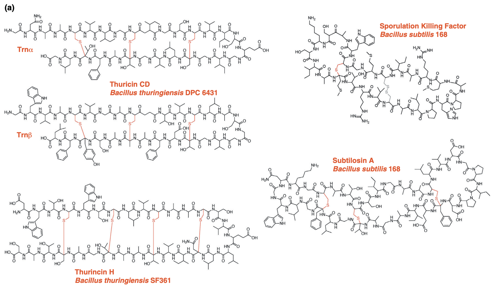

# Sactibonds
Evaluating protein structure prediction models by how closely they match known sulfur-to-alpha-carbon post-translational modifications.





### Paper 

Download the paper on [bioRxiv here](https://www.biorxiv.org/content/10.1101/2025.03.17.643596v1).


### Usage

For cross-linking structure prediction evaluation, run:

```bash
python structure_eval.py
```

For bonds sequence location prediction evaluation, run:

```bash
python bonds_eval.py
```


### Sources

Sactibond structures for the following peptides:

- Subtilosin A
- Thurincin H
- Thuricin CD alpha
- Thuricin CD beta
- Streptosactin
- Huazacin
- Qmp A
- Skf B
- Rum C

### Models evaluated to date

`ESMFold`:

Retrieved using the ESMFold API: https://esmatlas.com/. 

Script usage:
```bash
python peptide_folding.py
```

`AlphaFold 3`:

Retrieved using the AlphaFold webserver interface: https://alphafoldserver.com/

`AlphaFold 2`, `Boltz-1`. `RoseTTAFold2`, `OmegaFold`: 

Retrieved using the ColabFold notebooks: https://github.com/sokrypton/ColabFold

`Boltz-2`:

Retrieved using the Tamarind Bio server: https://app.tamarind.bio/app


### Citation

If you find this useful, please cite as follows:

```
Romain Lacombe. Non-canonical crosslinks confound evolutionary protein structure models. arXiv, 2025.
```


